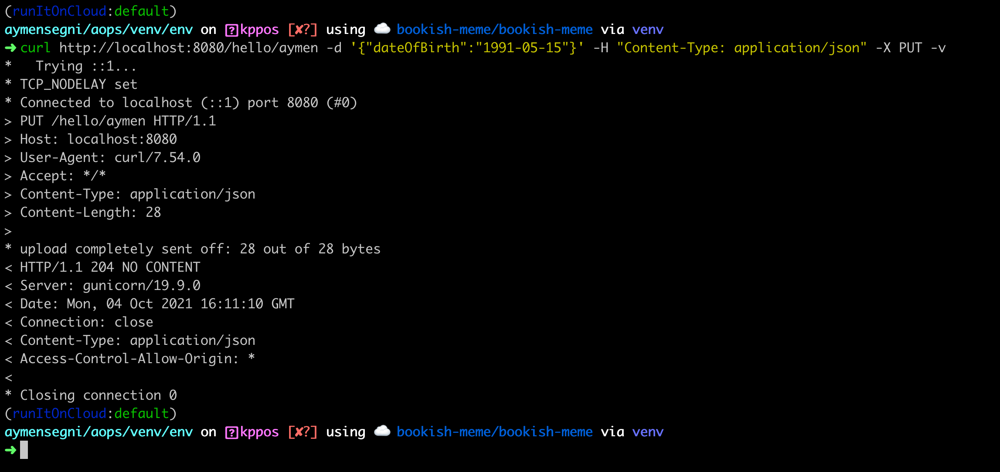
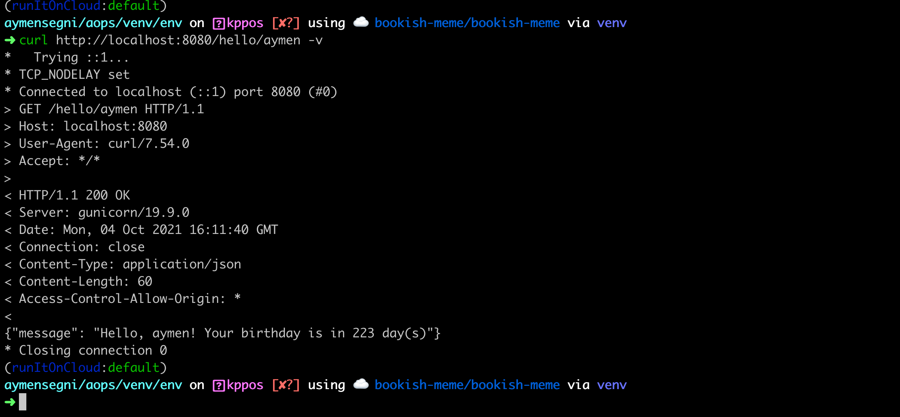

# bookish-meme Application
> When you're asked to Terraform Pluto

## Developing stack

- `Python Flask`:  a lightweight WSGI web application framework. It is designed to make getting started quick and easy, with the ability to scale up to complex applications. It began as a simple wrapper around Werkzeug and Jinja and has become one of the most popular Python web application frameworks

- `PostgreSQL` is a powerful, open source object-relational database system with over 30 years of active development that has earned it a strong reputation for reliability, feature robustness, and performance.

- `Docker Compose`: Compose is a tool for defining and running multi-container Docker applications. With Compose, you use a YAML file to configure your application's services.

## Assumption And Prerequisites

- You have a Docker environment running.
- You have an account in a container registry.
- You have Python installed on your machine for testing


# Endpoints

The application serve following endpoint structure and return the HTTP status codes appropriate to each operation.

Following are the implemented endpoints:

| Name     | Method    | URL
| ---      | ---       | ---
| saves    | `PUT`     | `/hello/<username>`
| returns  | `GET`     | `/hello/<username>`


##### Query Description

The query endpoint return all configs that satisfy the query argument.

**Query 1**:

Description: Saves/updates the given user’s name and date of birth in the database.
Request: `PUT /hello/<username> { “dateOfBirth”: “YYYY-MM-DD” }`
Response: `204 No Content`
Note:
<username> must contain only letters.
`YYYY-MM-DD` must be a date before the today date.

**Query 2**:

Description: Returns hello birthday message for the given user
Request: `Get /hello/<username>`
Response: `200 OK`
Response Examples:

A. If username’s birthday is in N days:

```
{ “message”: “Hello, <username>! Your birthday is in N day(s)” }
```

B. If username’s birthday is today:

```
{ “message”: “Hello, <username>! Happy birthday!” }
```

## Running the application in your machine

### Install dependencies:

```bash
    $ pip install -e .
```

### Running the app

```bash
    $ export FLASK_APP=manage:app
    $ export FLASK_ENV=development
    $ flask run
```
### Exploring the app

Open http://127.0.0.1:5000/metrics in a browser.


## Testing

- Install packages

```bash
    $ pip install '.[test]'
    $ pytest
```

- Run with coverage report

```sh
sudo pip3 install -r requirements/dev.txt
pytest --cov-report term --cov=project tests/
=========================================================================================== test session starts ====================================================================================                                                                                                                                                                            
....

tests/test_app.py ..........                                                                                                                                                                         [ 83%]
tests/test_models.py ..                                                                                                                                                                              [100%]

----------- coverage: platform linux, python 3.6.8-final-0 -----------
Name                  Stmts   Miss Branch BrPart  Cover
-------------------------------------------------------
project/__init__.py      24      1      0      0    96%
project/app.py           79     14     18      4    81%
project/config.py        19      1      2      1    90%
project/models.py        20      1      2      1    91%
-------------------------------------------------------
TOTAL                   142     17     22      6    86%


======================================================================================== 12 passed in 0.48 seconds =================================================================================
```

## Build and run the application with Docker Compose

- Build the images and spin up the containers:

```bash
sudo docker-compose up -d --build
```

(Optional) Recreate the database:

```bash
sudo docker-compose exec server python manage.py recreate_db
```

- Examples of executions:

1. 



2. 




## Build The Docker Image

The source code already contains the Dockerfile needed for the bookish-meme app.

* Build the image using the command below:

>You will need to consider changing the version with the appropriate values.

```bash
$ cd server && docker build -t bookish-meme_server:<version> .
```


## Publish The Docker Image

To upload the image to your registry, follow the steps below:

* Login: 

```bash
$ docker login
```

* Tag and Push the image to your account. (you can replace the username placeholder with your ID:

```bash
$ docker tag bookish-meme:<version>  <user_ID>/bookish-meme_server:<version>
```

```bash 
$ docker push <user_ID>/bookish-meme_server:<version>
```

